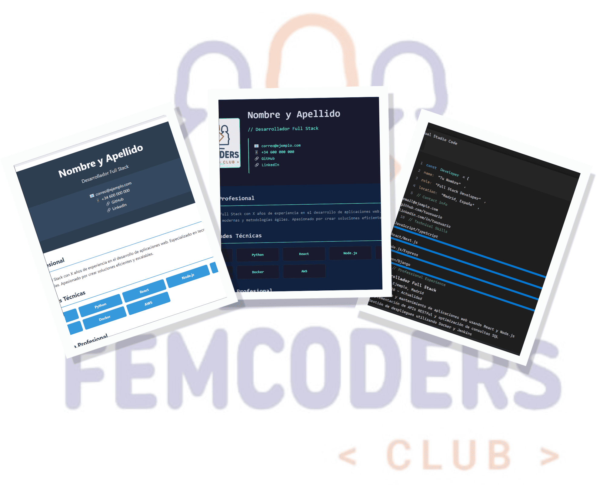

# cv4Coders 🎨💻  

¡Bienvenid@s al proyecto **cv4Coders**! 🎉 Este repositorio contiene una colección de plantillas modernas y profesionales de currículum vitae, diseñadas específicamente para desarrolladores y profesionales del mundo IT. 🚀



---

## 🎯 **Objetivo del Proyecto**  

Proporcionar herramientas prácticas, elegantes y fáciles de personalizar para que cualquier profesional pueda destacar sus habilidades y experiencia de manera única. Este proyecto es también un esfuerzo colaborativo de la comunidad de [femCoders Club](https://www.femcodersclub.com/).

---

## ✨ **Características Principales**  

- **Plantillas Profesionales**:
  - **Minimalista**: Elegancia y claridad para una presentación impecable.
  - **Creativa**: Resalta tu originalidad con un diseño moderno.
  - **Técnica**: Inspirada en un entorno de desarrollo, ideal para perfiles técnicos.
- **Edición Directa**: Modifica contenido directamente en el navegador con `contenteditable`.
- **Descarga en PDF**: Exporta tu CV con un solo clic usando `html2pdf.js`.
- **Diseño Responsive**: Adaptadas para dispositivos móviles y escritorio.
- **Completamente Personalizables**: Cambia colores, fuentes y contenido fácilmente.

---

## 📂 **Estructura del Proyecto**  

- **`plantillasHtml/`**: Contiene el HTML de cada plantilla.
- **`styles.css`**: Estilo base compartido por las plantillas.
- **`features/`**: Documentación y características adicionales.
- **`assets/`**: Recursos como imágenes y logos.

---

## 🚀 **Cómo Usar el Proyecto**

1. **Clonar el repositorio**:  

   ```bash
   git clone https://github.com/femcodersclub/cv4Coders.git
   cd cv4Coders
   ```

2. **Abrir en tu navegador**:  
   Accede a las plantillas abriendo directamente los archivos `.html`.

3. **Editar directamente**:  
   Haz clic en los elementos editables (`contenteditable`) para personalizar tu CV.

4. **Descargar en PDF**:  
   Usa el botón integrado en cada plantilla para generar un archivo PDF de tu CV.

---

## 🖼️ **Vista Previa de las Plantillas**

### **Plantilla Minimalista**  

Diseño limpio y profesional para destacar habilidades clave.  
[Ver Plantilla](./plantillasHtml/minimalista.html)

### **Plantilla Creativa**

Perfecta para perfiles originales que buscan destacar su creatividad.  
[Ver Plantilla](./plantillasHtml/creativo.html)

### **Plantilla Técnica**  

Ideal para desarrolladores que desean mostrar su experiencia de manera innovadora.  
[Ver Plantilla](./plantillasHtml/tecnico.html)

---

## 🛠️ **Contribuir al Proyecto**  

¡Tu creatividad es bienvenida! 🙌 Puedes contribuir enviando un [pull request](https://github.com/femcodersclub/cv4Coders/pulls) con nuevas plantillas o mejoras.  

### Pasos para Contribuir

1. **Crea una rama nueva**:

   ```bash
   git checkout -b feature/nueva-plantilla
   ```

2. **Haz tus cambios y súbelos**:

   ```bash
   git add .
   git commit -m "feat: agregar nueva plantilla"
   git push origin feature/nueva-plantilla
   ```

3. **Abre un pull request** desde GitHub.

---

## 🌟 **Agradecimientos**  

Este proyecto es posible gracias al esfuerzo y apoyo de la comunidad **[femCoders Club](https://www.femcodersclub.com/)**. Juntas estamos construyendo herramientas que empoderan a más profesionales en tecnología. 💜

---

## 📧 **Contacto**  

¿Tienes alguna pregunta o sugerencia? Escríbenos a:  
📩 [info@femcodersclub.com](mailto:info@femcodersclub.com)  
🌐 [Página de contacto](https://www.femcodersclub.com/contacto)

---

¡Gracias por ser parte de esta iniciativa! ✨
